# How to Play — Moon Traveler Terminal

You've crash-landed on Enceladus, Saturn's frozen moon. Your ship is wrecked. Your supplies are limited. Alien creatures inhabit the ice, and a small drone is your only companion. Gather repair materials, survive the cold, and get off this moon.

---

## System Requirements

On first launch you choose which AI model to download. The game detects your RAM and recommends the best fit.

| Model | Download | RAM Needed | Disk Total | Quality |
|-------|----------|------------|------------|---------|
| No model | 0 | 256 MB | 50 MB | Fallback dialogue |
| **SmolLM2 1.7B** | 1.0 GB | ~1.2 GB | ~1.1 GB | Good — low RAM systems |
| **Qwen3.5 2B** (default) | 1.3 GB | ~2.3 GB | ~1.5 GB | Very good — recommended |
| **Gemma 4 E2B** | 3.1 GB | ~4.4 GB | ~3.5 GB | Best — richest dialogue |

All models run on CPU. GPU (CUDA/Metal/Vulkan) is optional for faster inference. Without any model, creatures use pre-written dialogue and the game is fully playable.

---

## Getting Started

Run the game:

```
python play_tui.py
```

You'll be asked to choose:

1. **Difficulty** — Easy (~30 min), Medium (~1-2 hours), Hard (~3+ hours), or Brutal (~5+ hours)
2. **Compute mode** — auto-detected from config (changeable with `config gpu`)

If no AI model is found, the game will offer to **download one automatically**. You can choose between Qwen3.5 2B (1.3 GB, recommended) or Gemma 4 E2B (3.1 GB, richer dialogue). You can also skip — the game works without it using pre-written dialogue.

The game opens with a brief context line and offers to **skip the tutorial** for returning players. New players will see ARIA (your ship's AI) run a boot diagnostic before being dropped at the Crash Site. Follow the tutorial prompts — they'll walk you through the basics and then point you toward key mechanics like giving gifts, trading, escorting, and ship repair.

<p align="center">
  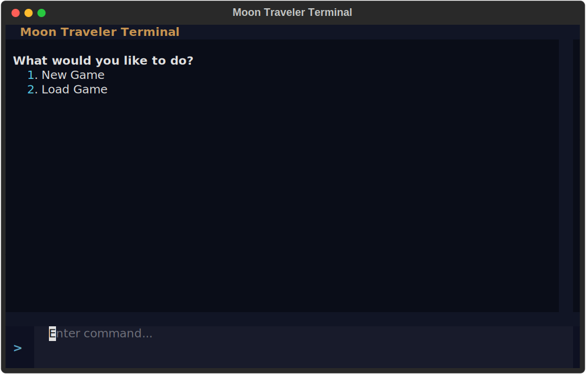
</p>

---

## Controls

Type commands at the prompt and press Enter. Tab autocomplete is supported for commands, locations, items, and creature names.

A **status bar** is displayed before every prompt showing food, water, suit, battery, inventory count, ship repair progress, and elapsed time. All vitals are always visible. When at the Crash Site, ship bay details are shown. When a creature is at your location, their name, archetype, disposition, and trust level appear. The **GPS** (`gps` command) shows food and water source markers for locations you've visited.

<p align="center">
  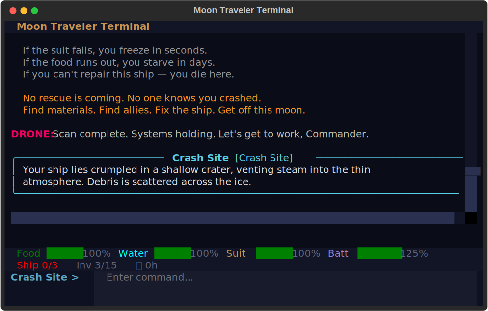
</p>

### Exploration

| Command | Aliases | What it does |
|---|---|---|
| `look` | `l` | Describe your current location — shows items, creatures, and resource sources |
| `scan` | — | Deploy the drone to discover up to 3 nearby locations (costs 10% battery) |
| `gps` | `map` | Show all known locations with distances from your position |
| `travel <location>` | `go` | Travel to a discovered location |

### Items & Inventory

| Command | Aliases | What it does |
|---|---|---|
| `take <item>` | `get`, `pick` | Pick up an item at your location |
| `inventory` | `inv`, `i` | Show everything you're carrying |
| `upgrade <component>` | — | Install a drone upgrade from your inventory |
| `inspect <item>` | `examine` | Examine an item to see what it's used for |
| `charge` | — | Toggle drone auto-charge on/off (requires Charge Module upgrade) |

### Creatures & Dialogue

| Command | Aliases | What it does |
|---|---|---|
| `talk <creature>` | `speak` | Start a conversation with a creature at your location (including followers) |
| `give <item> to <creature>` | — | Give an item to a creature to build trust (works with followers too) |
| `trade` | — | Trade items with a Merchant creature |
| `escort` | — | Ask a creature (trust 50+) to travel with you |
| `escort dismiss` | — | Choose which follower to dismiss (or dismiss all) |
| `rest` | — | Rest for 1 hour to recover food/water (+10%, or +20% at Crash Site) |

### Ship & Status

| Command | Aliases | What it does |
|---|---|---|
| `status` | — | Show food, water, suit integrity, time elapsed, and repair progress |
| `stats` | — | Show session gameplay statistics (commands, km, creatures, hazards) |
| `scores` | `leaderboard` | View local leaderboard (top 10 scores across all games) |
| `name` | — | Set or show your name (creatures use it in conversation; shown on leaderboard) |
| `ship` | `repair` | Ship bays menu — or use `ship <bay>` directly |
| `ship repair` | — | Install repair materials into the ship |
| `ship storage` | — | Stash/retrieve items from ship storage |
| `ship kitchen` | — | Cook items into food or water |
| `ship charging` | — | Recharge drone battery or overcharge with a Power Cell |
| `ship medical` | — | Repair suit or rest to recover food/water |
| `drone` | — | Show drone stats: battery, scanner range, translation quality, upgrades |

### Game Management

| Command | Aliases | What it does |
|---|---|---|
| `save [slot]` | — | Save your game (default slot: "manual") |
| `load [slot]` | — | Load a saved game |
| `clear` | `cls` | Clear the screen |
| `help` | — | Show the command list |
| `quit` | `exit` | Exit the game (prompts for confirmation) |
| `dev` | `devmode` | Toggle developer logging to `~/.moonwalker/dev/dev_diagnostics.jsonl` |
| `config` | — | View/change game settings (e.g. save path) |
| `sound` | — | Toggle sound effects on/off |

### Scanning and Navigation

<p align="center">
  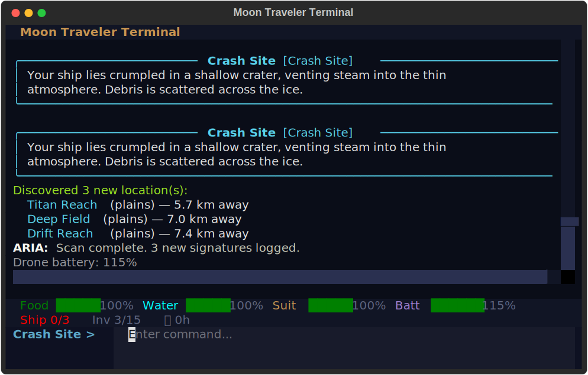
</p>

<p align="center">
  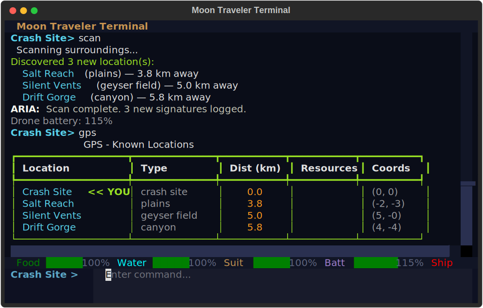
</p>

---

## Conversations

When you `talk` to a creature, you enter the ARIA Communicator — a real-time dialogue mode powered by a local AI model.

- **Type normally** to speak through the drone translator.
- **`bye`**, **`/end`**, **`/bye`**, or **`/quit`** to end the conversation.
- **`/?`** or **`/help`** for conversation help.
- **`/<command>`** to run a game command mid-conversation (e.g., `/status`, `/inventory`, `/look`).
- **`/give <item> to <creature>`** to hand over an item without leaving the conversation.

During conversations:

- Your **drone whispers private coaching tips** that the creature can't hear. These adapt to the creature's personality, disposition, and how much it trusts you.
- A **translation frame** occasionally appears, showing the drone working to translate the creature's speech.
- Each exchange increases trust by **+3 points**.
- ARIA comments after conversations when trust reaches certain thresholds.
- **Creatures can give you things during conversation** — what they offer depends on their archetype and trust level. Healers help even at low trust. Builders share materials at medium trust. Guardians and Hermits require high trust. You'll see a cyan status message when something is given.
- **Merchants trade** — use `/trade` during conversation or the `trade` command. They show what they have and what they want.

<p align="center">
  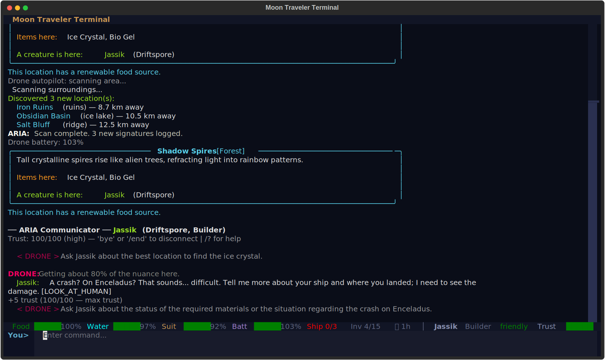
</p>

If no AI model is loaded, creatures use pre-written dialogue that still responds to their personality.

---

## Survival

Four meters track your condition. If food, water, or suit integrity reaches zero, you die.

### Food

- Starts at **100%**
- Depletes **2% per hour** of travel
- Replenished to 100% when you visit a location with a food source
- Can be restored by **cooking bio_gel** in the ship's Kitchen Bay (+40%)
- Can be restored by **resting** in the Medical Bay (+20%, costs 1 hour)
- Creatures may **share food** during conversation (at medium+ trust)

### Water

- Starts at **100%**
- Depletes **3% per hour** of travel
- Replenished to 100% when you visit a location with a water source
- Can be restored by **processing ice_crystal** in the Kitchen Bay (+40%)
- Can be restored by **resting** in the Medical Bay (+20%, costs 1 hour)
- Creatures may **share water** during conversation (at medium+ trust)

### Suit Integrity

- Starts at **92%** (damaged in the crash)
- Degrades **0.5% per hour** of travel
- Can be repaired in the **Medical Bay** using drone battery (2% suit per 1% battery)
- **Healer creatures** may repair your suit during conversation (+25%)
- **Healer companions** at the Crash Site restore +30%

<p align="center">
  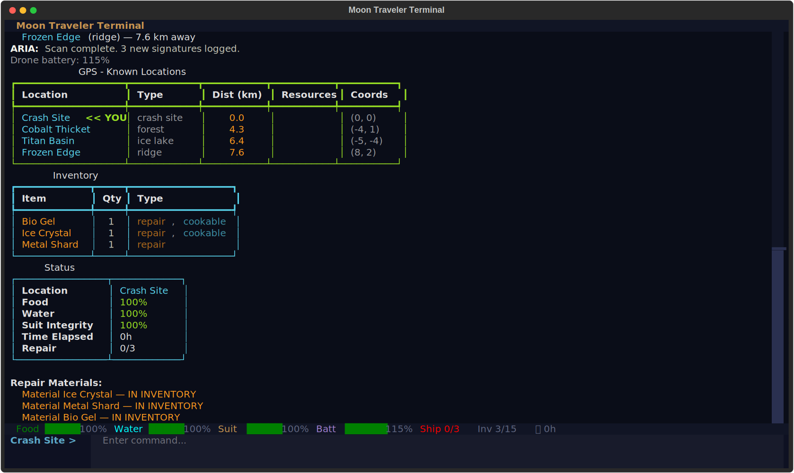
</p>

### Warnings

ARIA monitors all resources and fires warnings at **50%**, **30%**, **15%**, and **5%** thresholds. Each warning fires only once per threshold — replenishing a resource resets its warnings.

---

## The Drone

Your ARIA Scout Drone is your primary tool for exploring and communicating.

### Battery

- Starts at **100%**
- Scanning costs **10%**
- Travel costs **0.5% per km**
- Recharges to full at the **Crash Site** (automatically on arrival, or via the Charging Bay)
- Use a **Power Cell** in the Charging Bay to permanently increase max capacity by +10%
- When the battery is depleted, the drone goes silent — no musings, advice, or translation frames

### Default Stats

| Stat | Starting Value |
|---|---|
| Scanner Range | 10 km |
| Translation Quality | Low |
| Cargo Capacity | 10 items |
| Speed Boost | 0 km/h |
| Battery | 100% |

### Upgrades

Find these components in the world, then use `upgrade <name>` to install them:

| Upgrade | Effect |
|---|---|
| Range Module | +10 km scanner range |
| Translator Chip | Translation quality: low -> medium -> high |
| Cargo Rack | +5 cargo slots |
| Thruster Pack | +5 km/h travel speed |
| Battery Cell | +25% max battery capacity |
| Voice Module | Enables spoken voice announcements for game events |
| Autopilot Chip | Auto-scans and auto-looks when arriving at new locations |
| Charge Module | Enables auto-charge: drone recovers +5% battery per hour of travel |

Better translation quality means creatures speak more clearly and with fewer garbled words. The Voice Module replaces beep sounds with spoken announcements. The Autopilot Chip saves you from manually typing `look` and `scan` at every new location.

<p align="center">
  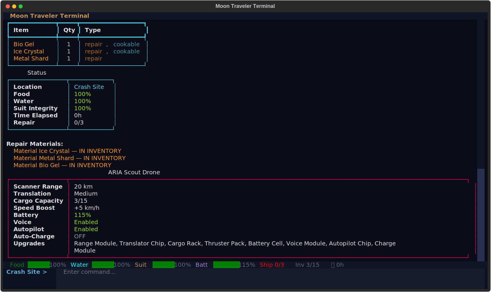
</p>

---

## Creatures

Enceladus is inhabited by alien creatures. Each one has a unique name, species, personality, and attitude toward you.

### Archetypes

Every creature has one of ten archetypes that determine their personality AND what they can provide:

| Archetype | Personality | What They Provide | Trust Needed |
|---|---|---|---|
| **Healer** | Gentle, empathetic | Healing, suit repair, food, water | 0 (heal/suit), 10 (food/water) |
| **Builder** | Practical, curious | Repair materials | 35 |
| **Wise Elder** | Patient, philosophical | Repair materials, creature intel | 50 (materials), 35 (intel) |
| **Guardian** | Protective, territorial | Repair materials | 70 |
| **Hermit** | Reclusive, secretive | Rare repair materials | 80 |
| **Wanderer** | Restless, well-traveled | Food, water, location reveals | 25 |
| **Trickster** | Playful, unpredictable | Materials, food, water | 35 |
| **Warrior** | Fierce, direct | Repair materials | 50 |
| **Merchant** | Fair, transactional | Trades items (never free) | 20 (trade) |
| **Enforcer** | Methodical, authoritative | Creature intel, ship repair advice | 15 (intel), 60 (materials) |

Every game guarantees at least one Merchant, one Builder, and one Healer.

### Dispositions

Each creature starts with one of three dispositions:

- **Friendly** (starts at 25 trust) — open and willing to talk
- **Neutral** (starts at 10 trust) — cautious but approachable
- **Hostile** (starts at 0 trust) — aggressive; may block you or chase you away

Hostile creatures with very low trust (below 15) refuse to talk and force you to back away. Build trust through gifts before attempting conversation.

<p align="center">
  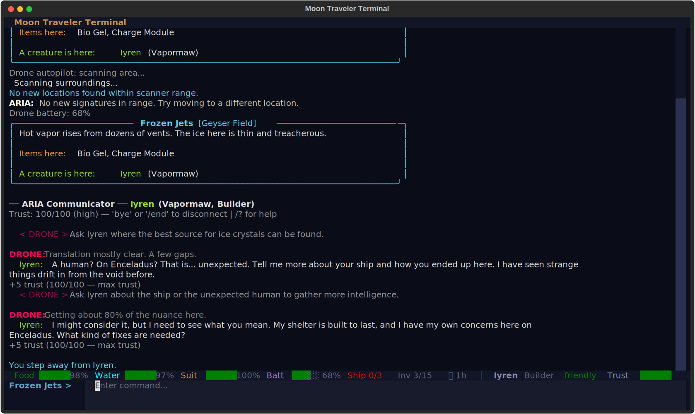
</p>

### Trust System

Trust ranges from **0 to 100** and determines what a creature is willing to share:

| Trust Level | Range | Behavior |
|---|---|---|
| Low | 0–34 | Guarded, minimal information |
| Medium | 35–69 | Warming up, more cooperative |
| High | 70–100 | Fully cooperative — shares materials and reveals locations |

**Gaining trust:**

- Conversation: **+3 per exchange**
- Giving gifts: **+15** (friendly/neutral) or **+10** (hostile)
- Escorting to Crash Site: **+10** bonus

**Role-based thresholds** — each archetype has different trust requirements for different actions:

- **Healers** heal and repair suits at **trust 0** — it's their calling
- **Wanderers** share food/water at **trust 25**
- **Builders** give repair materials at **trust 35**
- **Guardians** only share at **trust 70** — they protect their resources
- **Hermits** need **trust 80** — the hardest to crack, but they have rare materials
- **Merchants** trade at **trust 20** but never give for free

**At high trust (70+):**

- Creatures may reveal the locations of **food or water sources** you haven't discovered
- **Builders** may help install materials at the Crash Site

### Escorting Creatures

At trust **50+**, you can ask a creature to **travel with you** using the `escort` command. Companions:

- Move with you whenever you `travel`
- Appear in your status bar as "Following"
- **Actively help when you reach the Crash Site:**
  - **Healers** — restore suit (+30%), food/water (+25%)
  - **Builders / Wise Elders** — install a repair material from your inventory
  - **Any creature with materials** — donates their repair materials
- After helping at the ship, you can send them home or keep them
- Use `escort dismiss` to choose which follower to release (or dismiss all)

<p align="center">
  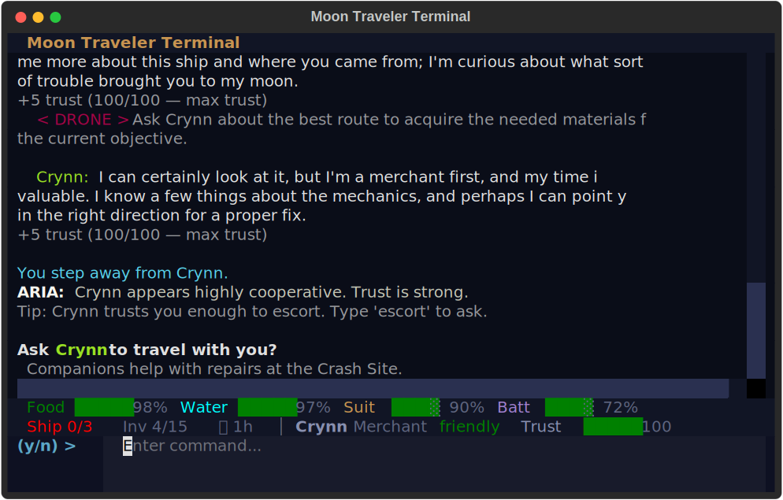
</p>

---

## Travel

Movement between locations takes time and consumes resources.

- **Base speed:** 10 km/h (increases with Thruster Pack upgrades)
- **Travel time:** distance / speed, rounded to nearest hour (minimum 1)
- **Resource cost per hour:** 2% food, 3% water, 0.5% suit integrity
- **Drone battery cost:** 0.5% per km traveled

During travel, you'll see narrated events — atmospheric moments, environmental details, drone observations, and ARIA weather data. Longer trips have more events (1 per ~2 hours, up to 5). On trips of 3+ hours, the drone may suggest a closer waypoint for future reference.

### Hazards

The environment is dangerous. During travel, you may encounter:

- **Geyser eruptions** — suit damage
- **Crevasse falls** — suit damage + food loss
- **Ice storms** — water loss + extra time
- **Thin ice collapse** — suit damage + water loss
- **Toxic vents** — suit damage
- **Thermal shocks** — suit + water damage

Hazard probability scales with trip length (more rolls on longer trips). ARIA will advise you on what to do after taking damage.

### Late-Game Weather

After extended time on the moon (30-60 hours depending on game mode), weather deteriorates:

- Hazard probabilities increase
- Extra water drain during travel
- Dramatic weather narration

This creates urgency to finish repairs before conditions become unmanageable.

There's a **15% chance** of finding a loose item (ice crystal or metal shard) during any trip.

The screen clears when you depart to create a sense of journey. On arrival, use `look` to observe your new surroundings.

<p align="center">
  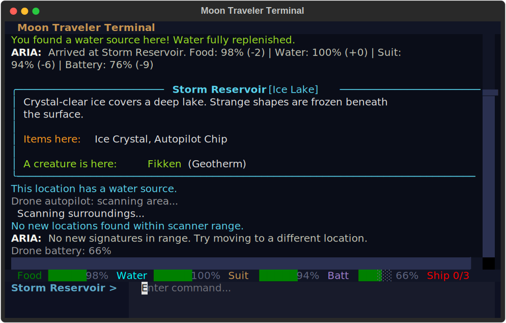
</p>

---

## Ship Repair — How to Win

Your goal is to collect all required repair materials **and** escort creatures to help at the Crash Site. You cannot complete the final repairs alone — creatures must assist.

### Escort Requirement

| Mode | Escorts Required |
|---|---|
| **Easy** | 1 creature |
| **Medium** | 2 creatures |
| **Hard** | 3 creatures |
| **Brutal** | 4 creatures |

Use `escort` to ask a creature with trust 50+ to travel with you. Bring them to the Crash Site and they'll help with repairs, donate materials, and provide support. The ship bay menu shows your escort progress.

### Materials by Game Mode

| Mode | Materials Required |
|---|---|
| **Short** | Ice Crystal, Metal Shard, Bio Gel |
| **Medium** | + Circuit Board, Power Cell |
| **Long** | + Thermal Paste, Hull Patch, Antenna Array |

### Where to Find Materials

- **From creatures** — the primary source. Each archetype provides different materials at different trust thresholds
- **Trading with Merchants** — offer items they want in exchange for repair materials
- **On the ground** at locations — some survival items (ice crystals, bio gel) can be picked up
- **During travel** — 15% chance to find ice crystals or metal shards

### Ship Bays

At the Crash Site, the `ship` command opens the bay menu. Each bay serves a different purpose:

| Bay | Command | What it does |
|---|---|---|
| **Repair** | `ship repair` | Install repair materials from your inventory into the ship |
| **Storage** | `ship storage` | Stash items from inventory into ship storage (frees drone cargo for exploration) or retrieve them later |
| **Kitchen** | `ship kitchen` | Cook bio_gel into food (+40%) or process ice_crystal into water (+40%) |
| **Charging** | `ship charging` | Full battery recharge (free), or sacrifice a Power Cell for +10% permanent max capacity |
| **Medical** | `ship medical` | Repair suit using drone battery, or rest to recover food/water (+20% each, costs 1 hour) |

Once all materials are installed and escort requirements are met, you win. A post-game score screen shows your stats, grade (S-D), and ARIA verdict. Scores are saved to a local leaderboard — type `scores` to view your top 10.

<p align="center">
  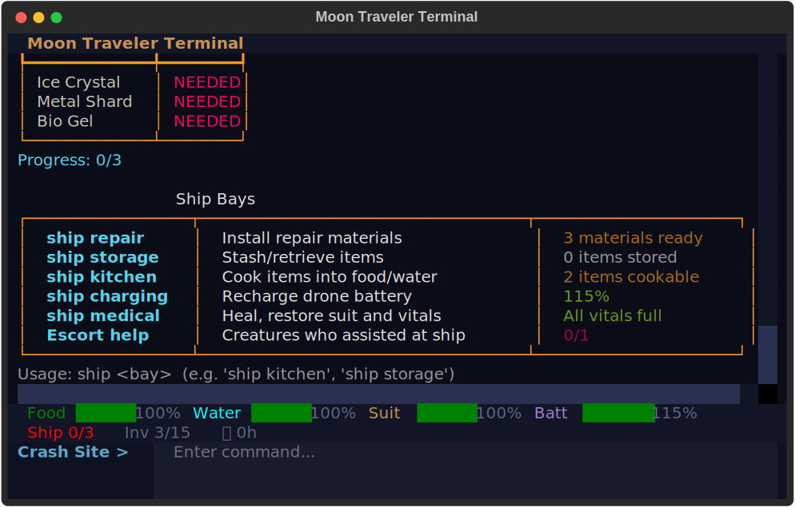
</p>

<p align="center">
  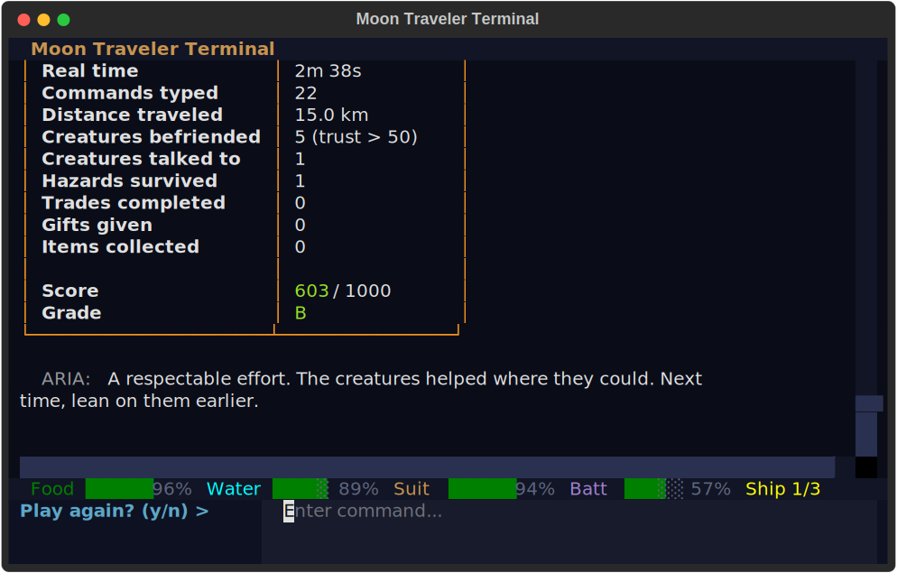
</p>

---

## Game Modes

| | Easy | Medium | Hard | Brutal |
|---|---|---|---|---|
| **Locations** | ~8 | ~16 | ~30 | ~40 |
| **Creatures** | 5 | 12 | 20 | 25 |
| **Hostile** | 0 | 4 | 6 | 12 |
| **World Radius** | ~20 km | ~40 km | ~60 km | ~80 km |
| **Repair Materials** | 3 | 5 | 8 | 8 |
| **Resource Drain** | Normal | Normal | Normal | 1.5x |
| **Estimated Time** | ~30 min | ~1–2 hours | ~3+ hours | ~5+ hours |

Higher difficulty means more hostile creatures, slower trust gain, scarcer items, and greater distances. Brutal mode adds 50% faster resource drain and earlier late-game weather.

### Game Over

If either food or water reaches zero, the game ends.

<p align="center">
  
</p>

---

## ARIA and the Drone — Two AI Voices

The game has two distinct AI companions:

### ARIA (Ship AI)

Speaks in white: `ARIA: ...`

- Clinical, strategic tone
- Fires resource warnings at threshold levels
- Gives periodic objective reminders (every ~10 commands)
- Provides post-travel summaries (location, food%, water%, suit%, battery%)
- Shares weather and environmental data during travel

### Drone (Field Companion)

Speaks in magenta: `DRONE: ...`

- Curious, supportive tone
- Comments during travel with sensor readings and observations
- Translates creature dialogue (quality depends on Translator Chip level)
- Whispers private coaching advice during conversations (creatures can't hear this)
- Goes silent when its battery is depleted

---

## Saving and Loading

- The game **auto-saves** after every travel and conversation (slot: "autosave")
- Use `save` for manual saves (default slot: "manual"), or `save myslot` for named slots
- Use `load` to list available saves, or `load myslot` to load directly
- Save files are stored in the `saves/` directory as SQLite databases

---

## Tips for New Players

1. **Follow the tutorial.** It walks you through look, scan, gps, travel, and talk, then points you to key mechanics.
2. **Find a Healer early.** Healers help at very low trust — they can save your life when resources are tight.
3. **Creatures are your main resource.** Repair materials come primarily from creatures, not the ground. Build trust.
4. **Talk to the Enforcer.** They know everyone in the area and can tell you who to visit for ship repairs.
5. **Trade with Merchants.** They never give for free, but a fair trade can get you critical repair materials.
6. **Scan at every new location.** Each scan discovers up to 3 nearby locations. Locations form a chain.
7. **Watch for hazards.** Travel damages your suit and drains resources. ARIA will advise you when damage occurs.
8. **Don't stay too long.** Late-game weather gets worse — hazards increase and water drains faster.
9. **Give gifts to hostile creatures.** They won't talk below 15 trust, so gifts (+10) break the ice.
10. **Escort creatures to the ship.** Builders install materials, Healers restore your vitals.
11. **Use "stash all" at the storage bay.** Quickly frees up drone cargo for exploration.
12. **Check GPS for resource markers.** Food and water sources show up at locations you've visited.
13. **Read the drone's whispers.** It gives specific, context-aware advice about what to ask each creature.
14. **Upgrade the translator early.** Better translation = clearer creature dialogue = more productive conversations.
15. **Use `gps` to plan routes.** Shorter trips use less food, water, and battery.

---

## Troubleshooting

### AI model won't download

If the automatic download fails (network issues, timeouts), you can manually download the GGUF model file and place it in the `models/` directory. The game looks for any `.gguf` file in that folder — no config changes needed.

- **SmolLM2 1.7B** — download the `.gguf` file (~1.0 GB) and place it in `~/.moonwalker/models/`
- **Qwen3.5 2B** — download the `.gguf` file (~1.3 GB) and place it in `~/.moonwalker/models/`
- **Gemma 4 E2B** — download the `.gguf` file (~3.1 GB) and place it in `~/.moonwalker/models/`

### GPU not detected

The game auto-detects CUDA, Metal, and Vulkan GPUs. If detection fails, it falls back to CPU-only inference. You can also manually choose CPU mode at startup.

- **CUDA (NVIDIA)** — ensure CUDA toolkit is installed and `llama-cpp-python` was built with CUDA support
- **Metal (Apple Silicon)** — should work automatically on macOS 12+
- **Vulkan** — requires Vulkan SDK and compatible GPU drivers

If GPU loading crashes, the game automatically retries with CPU-only. Gameplay is unaffected — inference is just slower.

### LLM model fails to load

If the model can't load (corrupted download, incompatible format, insufficient RAM), the game continues normally using pre-written fallback dialogue. Creatures respond with personality-appropriate scripted lines instead of AI-generated text. The game is fully playable without the LLM.

### Creature dialogue feels repetitive

- Check if the LLM is loaded — run `dev` to enable dev mode, then check the log for `"model_loaded": true`
- If the model isn't loaded, you're seeing fallback dialogue. Re-run the game and accept the model download prompt
- Upgrade the **Translator Chip** — better translation quality gives the LLM richer context, producing more varied responses

### Save files / changing save location

All user data is stored in `~/.moonwalker/` by default:

```
~/.moonwalker/
  config.json       # game configuration
  saves/            # save files (SQLite)
  models/           # downloaded AI models (.gguf)
  dev/              # dev mode diagnostic logs
```

Use the `config` command to view or change the save path:

```
config                          # show current config
config savedir /path/to/saves   # change save directory
```

The game auto-saves after every travel and conversation (slot: "autosave"). Use `save` for manual saves and `load` to list available slots.

Models placed in the legacy `models/` directory (project root) are still detected for backward compatibility.

### Game crashes or freezes during conversation

- LLM inference can be slow on CPU, especially with the larger Gemma model — wait a few seconds for the response
- If the game truly hangs, press `Ctrl+C` to exit the conversation safely
- Your progress is auto-saved — run `load autosave` on restart

---

## Dev Mode — Diagnostics & Debugging

Dev mode logs detailed game state to a JSON file for debugging, modding, or understanding the game's internals. It never affects gameplay — only writes log data.

### Enabling dev mode

```
dev           # toggle dev mode on/off
devmode       # same thing
```

When enabled, the game writes to `~/.moonwalker/dev/dev_diagnostics.jsonl` (one JSON object per line). Toggle it off to stop logging.

### Full diagnostic snapshots

Written every turn when dev mode is on. Each snapshot includes:

| Section | What it contains |
|---------|-----------------|
| **system** | RAM usage (RSS/VMS), CPU%, system RAM total/used, model file size, model RAM estimate, whether model is loaded |
| **game** | Mode, seed, location, food/water/suit/battery %, hours elapsed, inventory count, locations known/total, repair progress, tutorial step, LLM availability |
| **locations** | All locations sorted by distance — name, type, coordinates, distance, discovered/visited, items, food/water sources, creature present |
| **creatures** | All creatures — name, species, archetype, disposition, location, trust, following status, inventory, items given, available materials, trade wants, food/water knowledge, conversation count |
| **scan_tree** | Scanner reachability from current position — which locations are in range, and what's reachable from each (depth-2 lookahead) |
| **chat_history** | Full conversation history for every creature you've talked to — each message with role (user/assistant) and content |

### Event-level logging

Specific actions are logged as individual events:

| Event | Logged data |
|-------|-------------|
| `scan` | Location, discovered count, battery remaining |
| `travel_start` | Origin, destination, distance, food/water/suit/battery before |
| `travel_arrive` | Destination, food/water/suit/battery after, hours elapsed |
| `item_pickup` | Item name, location, inventory count |
| `trust_change` | Creature, old/new trust, source (conversation/gift/trade), exchange count |
| `llm_actions` | Creature, actions triggered (GIVE_WATER, HEAL, etc.), trust, archetype |
| `trade` | Creature, items exchanged, trust level |
| `repair_install` | Material installed, total progress |

### Checking NPC chat history and memory

There are two ways to inspect what creatures have said:

**1. During a conversation** — use the `/history` command:

```
talk Zyx'ra
You> /history
```

This shows the last 10 exchanges for the creature you're talking to. The game keeps up to 20 messages (10 exchanges) per creature in memory.

**2. Via dev mode logs** — the `chat_history` section of each diagnostic snapshot contains the full conversation history for every creature, including creature name, current trust level, total message count, and every message with role and content.

### Inspecting creature details

The `creatures` section of the dev log shows internal state not visible in normal gameplay:

- **Trust** — exact numeric value (0–100), not just the "low/medium/high" label
- **Disposition** — friendly, neutral, or hostile (their starting attitude)
- **Role inventory** — what items the creature has available to give
- **Can give materials** — which repair materials this creature can provide
- **Trade wants** — what a Merchant creature wants in exchange
- **Given items** — what you've already received from them
- **Food/water knowledge** — whether the creature knows about resource locations
- **Following** — whether the creature is currently escorting you

### Checking LLM and model status

The dev log's `system` section shows:

- `model_loaded` — `true` if the LLM model is active, `false` if using fallback dialogue
- `model_file_size_mb` — size of the loaded GGUF file on disk
- `model_ram_estimate_mb` — estimated RAM usage (~1.3x file size)
- `ram_rss_mb` / `ram_vms_mb` — actual process memory usage

The `game` section also includes `llm_available` (boolean).

### Reading the log file

The log is JSON Lines format — one JSON object per line:

```bash
# View the latest diagnostic snapshot
tail -1 ~/.moonwalker/dev/dev_diagnostics.jsonl | python -m json.tool

# Filter for trust changes
grep '"trust_change"' ~/.moonwalker/dev/dev_diagnostics.jsonl | python -m json.tool

# View all chat history from the latest snapshot
tail -1 ~/.moonwalker/dev/dev_diagnostics.jsonl | python -c "
import json, sys
data = json.load(sys.stdin)
for c in data.get('chat_history', []):
    print(f\"\n=== {c['creature']} (trust: {c['trust']}) ===\")
    for m in c['messages']:
        prefix = 'You' if m['role'] == 'user' else c['creature']
        print(f\"  {prefix}: {m['content']}\")"

# Count events by type
grep -o '"event":"[^"]*"' ~/.moonwalker/dev/dev_diagnostics.jsonl | sort | uniq -c | sort -rn
```

> **Note:** Dev mode never affects gameplay, save files, or performance. It only writes to the log file. Logging failures are silently ignored — the game never crashes due to dev mode.
