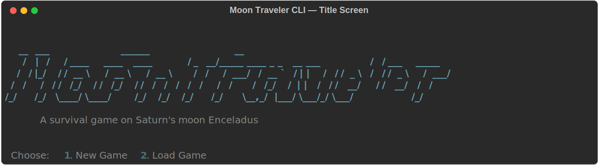
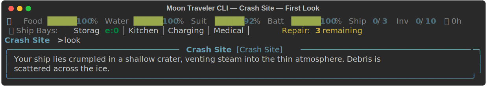
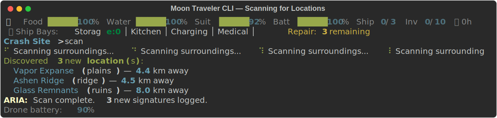
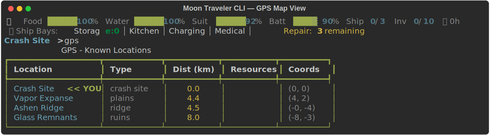
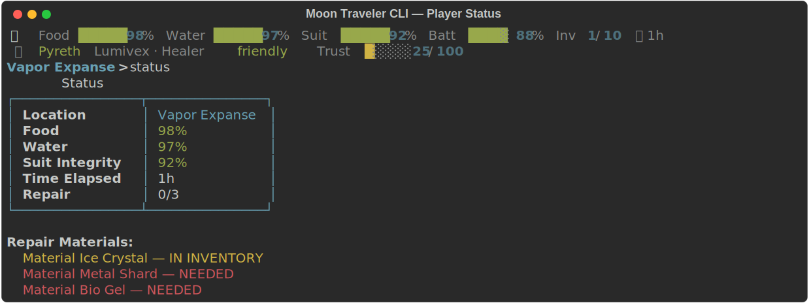
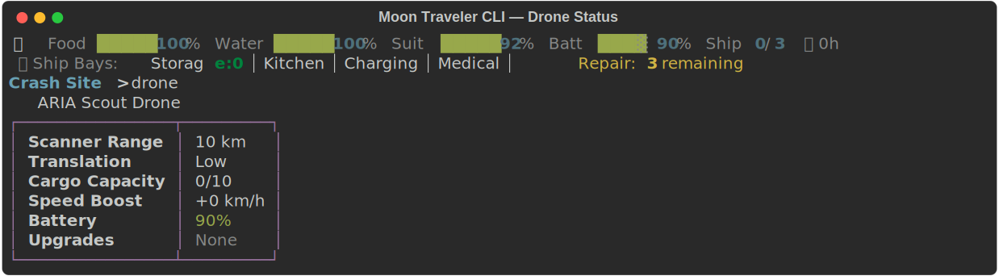
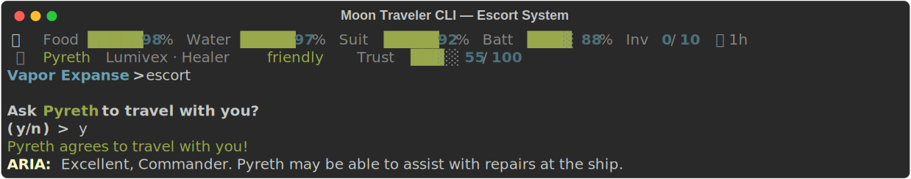
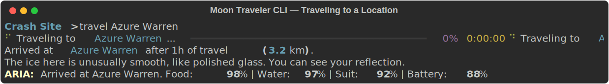
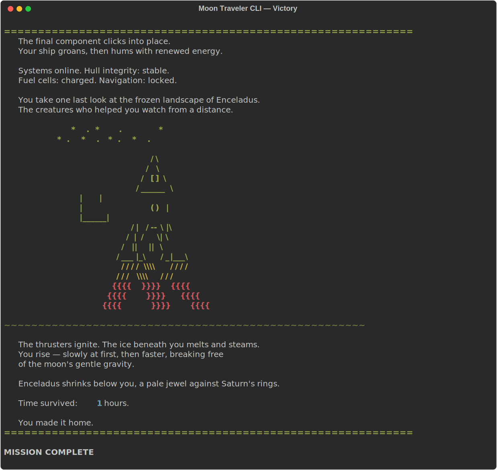
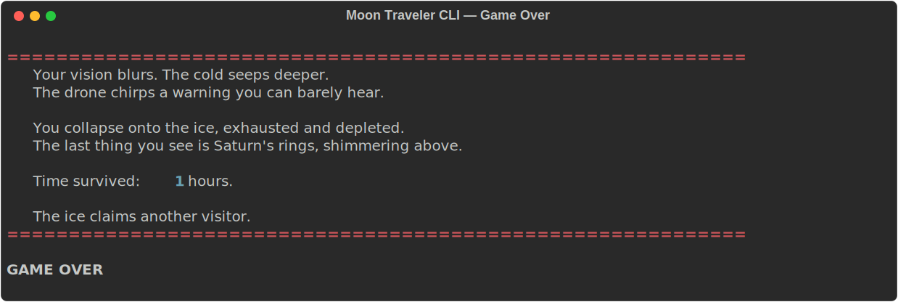

# How to Play — Moon Traveler CLI

You've crash-landed on Enceladus, Saturn's frozen moon. Your ship is wrecked. Your supplies are limited. Alien creatures inhabit the ice, and a small drone is your only companion. Gather repair materials, survive the cold, and get off this moon.

---

## System Requirements

The game has two modes depending on whether you use the AI model:

| | Without AI Model | With AI Model | With GPU |
|---|---|---|---|
| **RAM** | 256 MB | 6 GB | 2 GB (model in VRAM) |
| **CPU** | Any | 4+ cores | Any |
| **Disk** | 50 MB | 3.5 GB | 3.5 GB |
| **GPU** | Not needed | Not needed | 4 GB+ VRAM |

Without the AI model, creatures use pre-written dialogue — the game is fully playable, just less dynamic. The AI model downloads automatically on first launch (~2.9 GB).

---

## Getting Started

Run the game:
```
python play.py
```

You'll be asked to choose:
1. **Game length** — Short, Medium, or Long (see [Game Modes](#game-modes) below)
2. **Compute mode** — CPU + GPU or CPU Only (if a GPU is detected)

If no AI model is found, the game will offer to **download one automatically** (~2.9 GB from Hugging Face). You can skip this — the game works without it using pre-written dialogue, but conversations are much richer with the AI model.

The game opens with ARIA (your ship's AI) running a boot diagnostic, then drops you at the Crash Site. Follow the tutorial prompts — they'll walk you through the basics without getting in the way.

<p align="center">
  
</p>

---

## Controls

Type commands at the prompt and press Enter. Tab autocomplete is supported for commands, locations, items, and creature names.

A **status bar** is displayed before every prompt showing your food, water, suit, battery, ship repair progress, and elapsed time. When at the Crash Site, ship bay details are shown. When a creature is at your location, their name, archetype, disposition, and trust level appear.

<p align="center">
  
</p>

### Exploration

| Command | Aliases | What it does |
|---|---|---|
| `look` | `l` | Describe your current location — shows items, creatures, and resource sources |
| `scan` | — | Deploy the drone to discover up to 3 nearby locations (costs 10% battery) |
| `gps` | `map` | Show all known locations with distances from your position |
| `travel <location>` | `go` | Travel to a discovered location |

### Items & Inventory

| Command | Aliases | What it does |
|---|---|---|
| `take <item>` | `get`, `pick` | Pick up an item at your location |
| `inventory` | `inv`, `i` | Show everything you're carrying |
| `upgrade <component>` | — | Install a drone upgrade from your inventory |

### Creatures & Dialogue

| Command | Aliases | What it does |
|---|---|---|
| `talk <creature>` | `speak` | Start a conversation with a creature at your location |
| `give <item> to <creature>` | — | Give an item to a creature to build trust |
| `escort` | — | Ask a creature (trust 50+) to travel with you |
| `escort dismiss` | — | Let all followers stay at the current location |

### Ship & Status

| Command | Aliases | What it does |
|---|---|---|
| `status` | — | Show food, water, suit integrity, time elapsed, and repair progress |
| `ship` | `repair` | Ship bays menu — or use `ship <bay>` directly |
| `ship repair` | — | Install repair materials into the ship |
| `ship storage` | — | Stash/retrieve items from ship storage |
| `ship kitchen` | — | Cook items into food or water |
| `ship charging` | — | Recharge drone battery or overcharge with a Power Cell |
| `ship medical` | — | Repair suit or rest to recover food/water |
| `drone` | — | Show drone stats: battery, scanner range, translation quality, upgrades |

### Game Management

| Command | Aliases | What it does |
|---|---|---|
| `save [slot]` | — | Save your game (default slot: "manual") |
| `load [slot]` | — | Load a saved game |
| `clear` | `cls` | Clear the screen |
| `help` | — | Show the command list |
| `quit` | `exit` | Exit the game (prompts for confirmation) |
| `dev` | `devmode` | Toggle the developer diagnostics panel |

### Scanning and Navigation

<p align="center">
  
</p>

<p align="center">
  
</p>

---

## Conversations

When you `talk` to a creature, you enter the ARIA Communicator — a real-time dialogue mode powered by a local AI model.

- **Type normally** to speak through the drone translator.
- **`bye`**, **`/end`**, **`/bye`**, or **`/quit`** to end the conversation.
- **`/?`** or **`/help`** for conversation help.
- **`/<command>`** to run a game command mid-conversation (e.g., `/status`, `/inventory`, `/look`).
- **`/give <item> to <creature>`** to hand over an item without leaving the conversation.

During conversations:
- Your **drone whispers private coaching tips** that the creature can't hear. These adapt to the creature's personality, disposition, and how much it trusts you.
- A **translation frame** occasionally appears, showing the drone working to translate the creature's speech.
- Each exchange increases trust by **+3 points**.
- ARIA comments after conversations when trust reaches certain thresholds.
- **Creatures can give you things during conversation** — ask for water, food, healing, suit repair, or materials. At medium trust they may share water/food; at high trust they may give materials, heal you, or repair your suit. You'll see a cyan status message when something is given.

<p align="center">
  
</p>

If no AI model is loaded, creatures use pre-written dialogue that still responds to their personality.

---

## Survival

Three meters track your condition. If either food or water reaches zero, you die.

### Food
- Starts at **100%**
- Depletes **2% per hour** of travel
- Replenished to 100% when you visit a location with a food source
- Can be restored by **cooking bio_gel** in the ship's Kitchen Bay (+40%)
- Can be restored by **resting** in the Medical Bay (+20%, costs 1 hour)
- Creatures may **share food** during conversation (at medium+ trust)

### Water
- Starts at **100%**
- Depletes **3% per hour** of travel
- Replenished to 100% when you visit a location with a water source
- Can be restored by **processing ice_crystal** in the Kitchen Bay (+40%)
- Can be restored by **resting** in the Medical Bay (+20%, costs 1 hour)
- Creatures may **share water** during conversation (at medium+ trust)

### Suit Integrity
- Starts at **92%** (damaged in the crash)
- Degrades **0.5% per hour** of travel
- Can be repaired in the **Medical Bay** using drone battery (2% suit per 1% battery)
- **Healer creatures** may repair your suit during conversation (+25%)
- **Healer companions** at the Crash Site restore +30%

<p align="center">
  
</p>

### Warnings
ARIA monitors all resources and fires warnings at **50%**, **30%**, **15%**, and **5%** thresholds. Each warning fires only once per threshold — replenishing a resource resets its warnings.

---

## The Drone

Your ARIA Scout Drone is your primary tool for exploring and communicating.

### Battery
- Starts at **100%**
- Scanning costs **10%**
- Travel costs **0.5% per km**
- Recharges to full at the **Crash Site** (automatically on arrival, or via the Charging Bay)
- Use a **Power Cell** in the Charging Bay to permanently increase max capacity by +10%
- When the battery is depleted, the drone goes silent — no musings, advice, or translation frames

### Default Stats
| Stat | Starting Value |
|---|---|
| Scanner Range | 10 km |
| Translation Quality | Low |
| Cargo Capacity | 10 items |
| Speed Boost | 0 km/h |
| Battery | 100% |

### Upgrades
Find these components in the world, then use `upgrade <name>` to install them:

| Upgrade | Effect |
|---|---|
| Range Module | +10 km scanner range |
| Translator Chip | Translation quality: low -> medium -> high |
| Cargo Rack | +5 cargo slots |
| Thruster Pack | +5 km/h travel speed |
| Battery Cell | +25% max battery capacity |

Better translation quality means creatures speak more clearly and with fewer garbled words.

<p align="center">
  
</p>

---

## Creatures

Enceladus is inhabited by alien creatures. Each one has a unique name, species, personality, and attitude toward you.

### Archetypes
Every creature has one of eight personalities that affect how they behave in conversation:
- **Wise Elder** — patient, philosophical, shares deep knowledge
- **Trickster** — playful, evasive, speaks in riddles
- **Guardian** — protective, territorial, values strength
- **Healer** — gentle, empathetic, concerned with well-being
- **Builder** — practical, focused on construction and materials
- **Wanderer** — curious, well-traveled, tells stories of distant places
- **Hermit** — reclusive, distrustful, but deeply knowledgeable
- **Warrior** — aggressive, respects direct confrontation

### Dispositions
Each creature starts with one of three dispositions:
- **Friendly** (starts at 25 trust) — open and willing to talk
- **Neutral** (starts at 10 trust) — cautious but approachable
- **Hostile** (starts at 0 trust) — aggressive; may block you or chase you away

Hostile creatures with very low trust (below 15) refuse to talk and force you to back away. Build trust through gifts before attempting conversation.

<p align="center">
  
</p>

### Trust System
Trust ranges from **0 to 100** and determines what a creature is willing to share:

| Trust Level | Range | Behavior |
|---|---|---|
| Low | 0–34 | Guarded, minimal information |
| Medium | 35–69 | Warming up, more cooperative |
| High | 70–100 | Fully cooperative — shares materials and reveals locations |

**Gaining trust:**
- Conversation: **+3 per exchange**
- Giving gifts: **+15** (friendly/neutral) or **+10** (hostile)
- Escorting to Crash Site: **+10** bonus

**At medium trust (35+):**
- Creatures may share **food or water** if you ask during conversation

**At high trust (70+):**
- The creature gives you **1–2 repair materials**
- It may reveal the locations of **food or water sources** you haven't discovered
- **Healers** may heal you (+30% food/water) or repair your suit (+25%)
- **Builders** may help install materials at the Crash Site

### Escorting Creatures

At trust **50+**, you can ask a creature to **travel with you** using the `escort` command. Companions:
- Move with you whenever you `travel`
- Appear in your status bar as "Following"
- **Actively help when you reach the Crash Site:**
  - **Healers** — restore suit (+30%), food/water (+25%)
  - **Builders / Wise Elders** — install a repair material from your inventory
  - **Any creature with materials** — donates their repair materials
- After helping at the ship, you can send them home or keep them
- Use `escort dismiss` to let followers stay at any location

<p align="center">
  
</p>

---

## Travel

Movement between locations takes time and consumes resources.

- **Base speed:** 10 km/h (increases with Thruster Pack upgrades)
- **Travel time:** distance / speed, rounded to nearest hour (minimum 1)
- **Resource cost per hour:** 2% food, 3% water, 0.5% suit integrity
- **Drone battery cost:** 0.5% per km traveled

During travel, you'll see narrated events — atmospheric moments, environmental details, drone observations, and ARIA weather data. Longer trips have more events (1 per ~2 hours, up to 5). On trips of 3+ hours, the drone may suggest a closer waypoint for future reference.

There's a **15% chance** of finding a loose item (ice crystal or metal shard) during any trip.

The screen clears when you depart to create a sense of journey. On arrival, use `look` to observe your new surroundings.

<p align="center">
  
</p>

---

## Ship Repair — How to Win

Your goal is to collect all required repair materials and install them at the Crash Site.

### Materials by Game Mode

| Mode | Materials Required |
|---|---|
| **Short** | Ice Crystal, Metal Shard, Bio Gel |
| **Medium** | + Circuit Board, Power Cell |
| **Long** | + Thermal Paste, Hull Patch, Antenna Array |

### Where to Find Materials
- **On the ground** at locations — use `take` to pick them up
- **From creatures** at high trust (70+) — each creature can give 1–2 random materials
- **During travel** — 15% chance to find ice crystals or metal shards

### Ship Bays

At the Crash Site, the `ship` command opens the bay menu. Each bay serves a different purpose:

| Bay | Command | What it does |
|---|---|---|
| **Repair** | `ship repair` | Install repair materials from your inventory into the ship |
| **Storage** | `ship storage` | Stash items from inventory into ship storage (frees drone cargo for exploration) or retrieve them later |
| **Kitchen** | `ship kitchen` | Cook bio_gel into food (+40%) or process ice_crystal into water (+40%) |
| **Charging** | `ship charging` | Full battery recharge (free), or sacrifice a Power Cell for +10% permanent max capacity |
| **Medical** | `ship medical` | Repair suit using drone battery, or rest to recover food/water (+20% each, costs 1 hour) |

Once all materials are installed via the Repair Bay, you win.

<p align="center">
  
</p>

<p align="center">
  
</p>

---

## Game Modes

| | Short | Medium | Long |
|---|---|---|---|
| **Locations** | ~8 | ~16 | ~30 |
| **Creatures** | 5 | 12 | 20 |
| **World Radius** | ~20 km | ~40 km | ~60 km |
| **Repair Materials** | 3 | 5 | 8 |
| **Estimated Time** | ~30 min | ~1–2 hours | ~3+ hours |

Longer modes have more hostile creatures, greater distances, and require careful resource management. Food, water, and drone battery become genuine strategic concerns.

### Game Over

If either food or water reaches zero, the game ends.

<p align="center">
  
</p>

---

## ARIA and the Drone — Two AI Voices

The game has two distinct AI companions:

### ARIA (Ship AI)
Speaks in white: `ARIA: ...`
- Clinical, strategic tone
- Fires resource warnings at threshold levels
- Gives periodic objective reminders (every ~10 commands)
- Provides post-travel summaries (location, food%, water%, suit%, battery%)
- Shares weather and environmental data during travel

### Drone (Field Companion)
Speaks in magenta: `DRONE: ...`
- Curious, supportive tone
- Comments during travel with sensor readings and observations
- Translates creature dialogue (quality depends on Translator Chip level)
- Whispers private coaching advice during conversations (creatures can't hear this)
- Goes silent when its battery is depleted

---

## Saving and Loading

- The game **auto-saves** after every travel and conversation (slot: "autosave")
- Use `save` for manual saves (default slot: "manual"), or `save myslot` for named slots
- Use `load` to list available saves, or `load myslot` to load directly
- Save files are stored in the `saves/` directory as JSON

---

## Tips for New Players

1. **Follow the tutorial.** It walks you through look, scan, gps, travel, and talk in a natural order.
2. **Scan at every new location.** Each scan discovers up to 3 nearby locations. Locations form a chain — scanning from newly discovered places reveals more of the map.
3. **Watch your drone battery.** Plan trips so you can return to the Crash Site to recharge before it's empty.
4. **Talk to everyone.** Each conversation gives +3 trust. Friendly creatures start at 25 — just 15 exchanges to reach high trust.
5. **Give gifts to hostile creatures.** They won't talk to you below 15 trust, so gifts (+10) are the only way to break the ice.
6. **Ask creatures for help in conversation.** At medium trust, try asking for water or food. At high trust, ask for materials or healing.
7. **Escort creatures to the ship.** Builders and Healers are especially useful — they install materials and restore your vitals.
8. **Use the Kitchen Bay.** Cook bio_gel for food and ice_crystal for water — don't let useful items sit in your inventory.
9. **Stash items you don't need.** Ship storage frees up drone cargo space so you can carry more during exploration.
10. **Read the drone's whispers.** Its coaching tips are context-aware — it tells you how to approach each creature type.
11. **Upgrade the translator early.** Better translation quality means clearer creature dialogue, making conversations more productive.
12. **Use `gps` to plan routes.** Shorter trips use less food, water, and battery.
13. **Use `clear` if the screen gets cluttered.** The status bar above your prompt always shows your current state at a glance.
