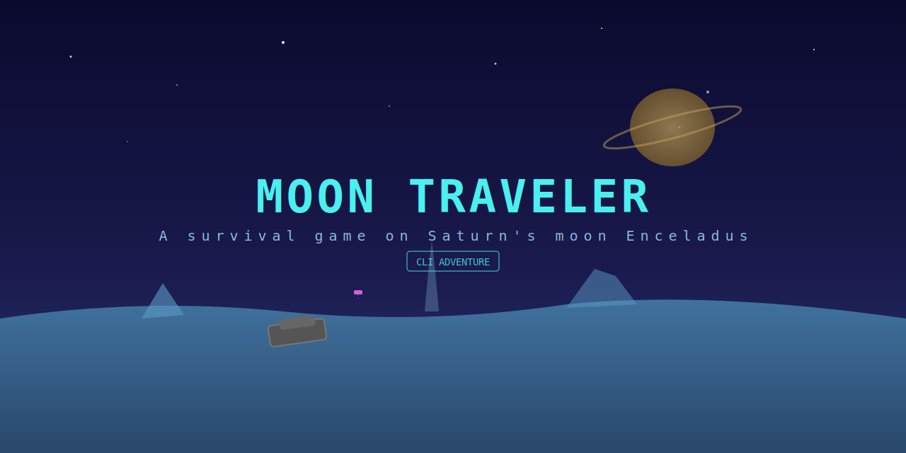
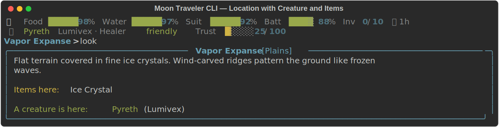
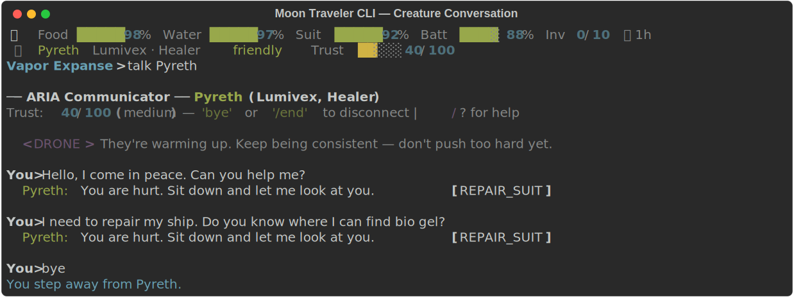
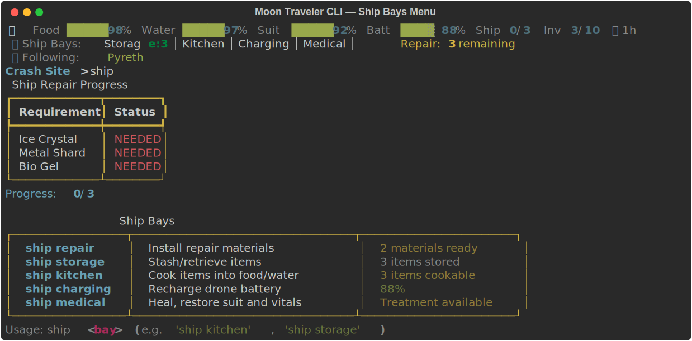

# Moon Traveler CLI

<p align="center">
  
</p>

A text-based survival game set on Enceladus, Saturn's icy moon. You've crash-landed and must explore procedurally generated locations, befriend alien creatures through LLM-powered conversations, and gather materials to repair your ship.

<p align="center">
  
</p>

## Features

- **Procedural world generation** with seeded RNG and chain-connected locations for replayable maps
- **LLM-powered creature dialogue** using a local AI model (Qwen3.5 2B default, Gemma 4 E2B optional — auto-downloads on first run)
- **Creature actions in conversation** — NPCs can give you food, water, materials, healing, and suit repair based on trust
- **Escort system** — befriend creatures and bring them to your ship for hands-on repair help
- **AI drone companion** that translates alien speech, gives tactical advice, and comments during travel
- **Trust-based relationships** with 8 creature archetypes and 3 dispositions
- **Ship bays** — Storage, Kitchen (cook items into food/water), Charging, Medical, and Repair
- **Survival mechanics** tracking food, water, suit integrity, and drone battery
- **Live status bar** showing vitals, ship progress, creature info, and followers
- **GPU acceleration** with automatic detection and user-selectable CPU/GPU mode
- **Rich terminal UI** with styled text, progress bars, and ASCII art
- **Save/load system** with silent auto-save and manual slots
- **CI/CD pipeline** with GitHub Actions for cross-platform builds

## System Requirements

### Minimum (fallback dialogue, no AI model)

| Resource | Requirement |
|----------|-------------|
| **CPU** | Any modern CPU (x86_64 or ARM64) |
| **RAM** | 256 MB |
| **Disk** | 50 MB (game only) |
| **OS** | Windows 10+, macOS 12+, Linux (glibc 2.31+) |
| **Python** | 3.11+ (not needed for pre-built releases) |

### Recommended — Qwen3.5 2B (default model)

| Resource | Requirement |
|----------|-------------|
| **CPU** | 4+ cores (inference uses 4 threads) |
| **RAM** | 4 GB (game ~50 MB + model ~2.3 GB in memory) |
| **Disk** | 1.5 GB (game 50 MB + model 1.3 GB) |
| **GPU** | Optional — CUDA/Metal/Vulkan for faster inference |

### Full Quality — Gemma 4 E2B (optional)

| Resource | Requirement |
|----------|-------------|
| **RAM** | 6 GB (game ~50 MB + model ~4.4 GB in memory) |
| **Disk** | 3.5 GB (game 50 MB + model 3.1 GB) |
| **GPU** | Optional — 4 GB+ VRAM for full model offload |

> On first launch you choose which model to download. Qwen3.5 2B (1.3 GB) is recommended for most machines. Gemma 4 E2B (3.1 GB) offers slightly richer dialogue. The game also runs without any model using pre-written dialogue.

## Installation

### 1. Clone the repository

```bash
git clone https://github.com/your-username/moon-traveler-cli.git
cd moon-traveler-cli
```

### 2. Install dependencies

Using uv (recommended):
```bash
uv sync
```

Using pip:
```bash
pip install -r requirements.txt
pip install rich prompt_toolkit psutil
```

### 3. LLM Model (optional)

On first launch, the game offers to download an AI model:

| Model | Size | RAM | Quality |
|-------|------|-----|---------|
| **Qwen3.5 2B** (default) | 1.3 GB | ~2.3 GB | Good — best for most machines |
| **Gemma 4 E2B** (optional) | 3.1 GB | ~4.4 GB | Very Good — richer dialogue |

You can also place any `.gguf` model file manually in the `models/` directory. The game falls back to pre-written dialogue if no model is found.

## Running

```bash
python play.py
```

On startup you'll choose:
1. **Game length** (Short / Medium / Long)
2. **Compute mode** (CPU + GPU or CPU Only, if GPU detected)

## How to Play

For a comprehensive guide covering survival mechanics, creature interactions, drone upgrades, and strategy tips, see **[HOW_TO_PLAY.md](HOW_TO_PLAY.md)**.

### Commands

| Command | Description |
|---------|-------------|
| `look` | Describe current location |
| `scan` | Use drone to discover nearby locations |
| `gps` / `map` | Show known locations with distances |
| `travel <location>` | Travel to a discovered location |
| `take <item>` | Pick up an item |
| `inventory` / `inv` | Show your inventory |
| `talk <creature>` | Talk to a creature (LLM dialogue) |
| `give <item> to <creature>` | Give an item to build trust |
| `escort` | Ask a creature (trust 50+) to travel with you |
| `drone` | Show drone status |
| `upgrade <component>` | Install a drone upgrade |
| `status` | Show food, water, suit, and repair progress |
| `ship` | Ship bays menu (repair, storage, kitchen, charging, medical) |
| `save` / `load` | Save or load game |
| `clear` / `cls` | Clear the screen |
| `help` | Show all commands |
| `quit` | Exit game |

### During Conversations

<p align="center">
  
</p>

- Type normally to speak through the drone translator
- Type `/end` or `bye` to leave the conversation
- Type `/?` for conversation help
- Use `/<command>` to run game commands mid-conversation (e.g., `/status`, `/inventory`)
- The drone whispers private advice that the creature can't hear

### Winning

Collect all required repair materials, bring them to the Crash Site, and install them via `ship repair`. Escort friendly creatures to the ship — Builders and Healers actively help with repairs.

<p align="center">
  
</p>

### Survival Tips

- Watch your food and water — they deplete during travel
- Cook bio_gel (food) and ice_crystal (water) at the ship's Kitchen Bay
- Ask creatures for food/water during conversation — they'll share at medium+ trust
- Escort Healers to the ship for free suit repair and vital restoration
- The drone's battery drains during scanning and travel; recharge at the Crash Site
- Build trust by having conversations (+3 per exchange) and giving gifts (+10-15)
- Use Ship Storage to stash items and free up drone cargo for exploration

## Game Modes

| Mode | Locations | Creatures | Radius | Duration |
|------|-----------|-----------|--------|----------|
| Short | ~8 | 5 | ~20 km | ~30 min |
| Medium | ~16 | 12 | ~40 km | ~1-2 hours |
| Long | ~30 | 20 | ~60 km | ~3+ hours |

## Building a Release

A cross-platform build script is included:

```bash
python scripts/build_release.py
```

This creates standalone executables for Windows, macOS, and Linux in the `dist/` directory using PyInstaller. See `scripts/build_release.py` for details.

## Development

### Running Tests

```bash
python -m pytest tests/ -v
```

### Code Style

The project uses [ruff](https://github.com/astral-sh/ruff) for linting:
```bash
ruff check src/
```

## Project Structure

```
moon-traveler-cli/
  play.py              Entry point
  src/
    game.py            Main game loop, init, win/lose
    world.py           Procedural world generation
    player.py          Player state, inventory, survival meters
    creatures.py       Creature generation, trust, dialogue
    drone.py           Drone: scanning, speech, translation, advice
    travel.py          Movement, events, drone musings
    commands.py        Command registry, NPC chat with drone interjections
    llm.py             LLM interface, GPU detection
    ship_ai.py         ARIA ship AI: warnings, summaries
    ui.py              Rich console output, ASCII art
    tutorial.py        Boot sequence, guided tutorial
    save_load.py       JSON serialization
    input_handler.py   Autocomplete
    dev_mode.py        Developer panel
    data/
      names.py         Name pools
      prompts.py       LLM prompts + drone message pools
  models/              GGUF model files
  saves/               Save game files
  tests/               Test suite
  scripts/             Build and release scripts
```

## License

Apache License 2.0 — see [LICENSE](LICENSE) for details.
